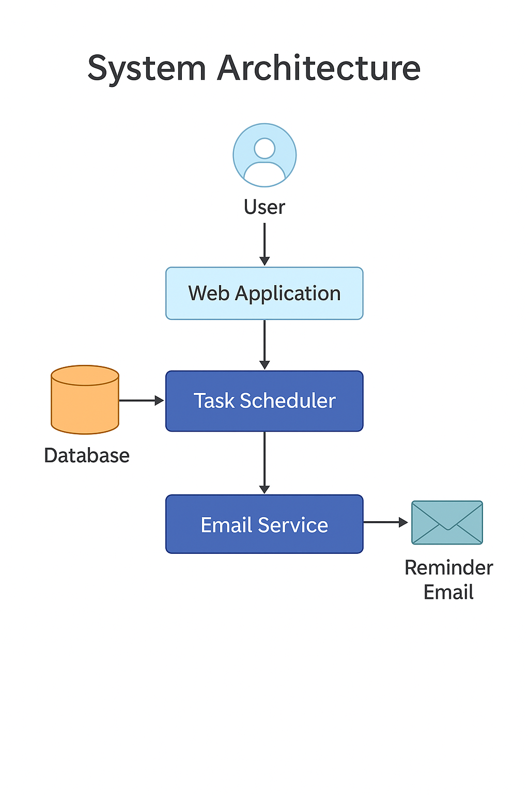

# 🛠️ System Design Overview

## 📐 Technical Architecture

The system uses a collection of custom and standard Salesforce objects with carefully designed relationships to balance flexibility with ease of use. Automation is provided through declarative tools (primarily Flows) rather than code, making the system maintainable even for organizations without development resources.

## 🔗 Key Object Relationships

- **Project** (Custom Object) — central to all activities
- **Project Task** (Custom Object) — linked to Projects
- **User / Contact** — assigned to Projects and Tasks
- **Reports & Dashboards** — draw data from Projects + Tasks
- **Automation** — one Scheduled Flow for reminders

## 🔄 Flow Overview

A single **Scheduled Flow** checks for tasks due tomorrow, loops through them, and sends reminder emails.

## 📊 Visual Diagram

> (See diagram in `/docs/System_Architecture.png`)
